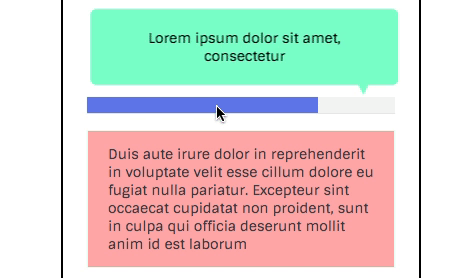

#CSS & HTML shake interaction - Flex trick
by: Orit Kozolin - FrontEnd / FullStack Developer Linkedin

<b>Purpose: </b>

Activate animation where the triggering element should be displayed after the animated element.

<b>The Problem: </b>

With only pure HTML,CSS the triggering element should be placed as a parent or a sibling ,<b>preceding</b> the animated elemenet in the DOM tree.  Which is the opposite of how we want it to be displayed in the page. Checkout the code to see how it's done.

###Run

Open <strong>index.html</strong> in the browser.

###How to see the effect
Hover over the blue bar, and watch the notification shake. That's the effect.

###The trick
For this to work you need to do 2 steps in your code:

1. HTML - Place the triggering element (the bar) first in the DOM. And, the triggered element (the notification) after (as siblings HTML elements, or as parent and child)

2. CSS - Flip their display (rendering) using 'flex-direction: reverse-column' (This is the trick!).

That's it , you're done!
